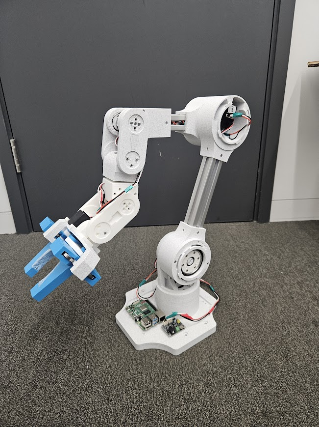

<h1 align="center">
🥳 Ark_Bot 🥳
</h1>
The Ark robot. Release Version 1.0 

  
   
  This is the Ark_bot, a pick-and-place robotic arm designed to be affordable and easy to build at home. With the intention of demonstrating the ark_framework's capabilities and planning for future real-life reinforcement learning. This design comes complete with a complete URDF file (inertia matrices to be added soon)

  

## Installation

1. Create and activate conda/virtual environment.
2. Clone this repository.

- (ssh) `git clone git@github.com:Robotics-Ark/arkbot.git`
- (https) `git clone https://github.com/Robotics-Ark/arkbot.git`

3. Change directory: `cd ark_bot`
4. Install `pip install -e .`
