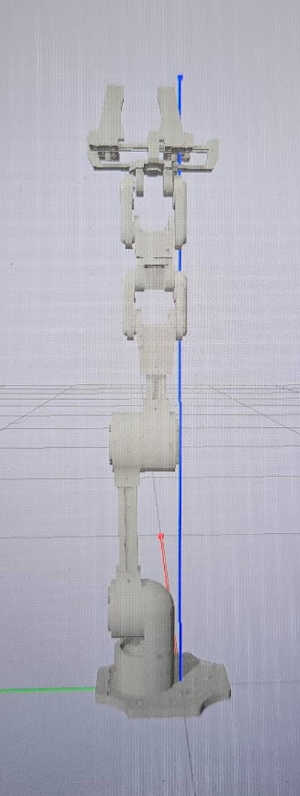

<h1 align="center">
🥳 Ark_Bot 🥳
</h1>

> **Handbook**  
> Version: `v1.0.0` • Date: `<2025-10>` • Author: `Harry Warriner / Ark`

---

<div align = "center">

</div>

## Table of Contents

- [1. Overview](#1-overview)
- [2. Safety & Warnings](#2-safety--warnings)
- [3. What’s in the Box](#3-whats-in-the-box)
- [4. Required Tools](#4-required-tools)
- [5. Specifications](#5-specifications)
- [6. Before You Start](#6-before-you-start)
- [7. Quick Start](#7-quick-start)
- [8. Assembly Guide](#8-assembly-guide)
- [9. Wiring / Connections](#9-wiring--connections)
- [10. Software Setup](#10-software-setup)
- [11. Calibration](#11-calibration)
- [12. Operation](#12-operation)
- [13. Maintenance](#13-maintenance)
- [14. Troubleshooting](#14-troubleshooting)
- [15. FAQ](#15-faq)
- [16. Revision History](#16-revision-history)
- [Appendix A: Bill of Materials](#appendix-a-bill-of-materials)
- [Appendix B: Licenses & Credits](#appendix-b-licenses--credits)

---

## 1. Overview

**Purpose:** ArkBot is designed to be an affordable high strength, high accuracy robotic arm you can build at home.  
**Scope:** This handbook covers how to build ArkBot and how to get it running within the Ark Framework.

The ArkBot is a pick-and-place robotic arm designed to be affordable and easy to build at home. With the intention of demonstrating the <a href="https://github.com/Robotics-Ark/ark_framework">ark_framework's</a> capabilities. Comes complete with an accurate URDF file. <br>

<table align="center">
  <tr>
    <td align="center" style="border: none;">
      
    </td>
    <td align="center" style="border: none;">
      
    </td>
  </tr>
</table>

---

## 2. Example videos

<table>
<tr>
<td ></td>
<td ></td>
<td >
  
</td>

</tr>
</table>

## 3. Bill of Materials.

The parts ordered from either side (amazon or cheapest) are the same parts, the difference is the time and price. The amazon links will come significantly faster whilst the others will take a while longer.
At the bottom though there are two different PLA filaments, the bambu or an equivalent high brand printer filament is reccomended, but if on a budget, the amazon ones will work fine.

| Totals | Amazon Total: | Cheapest Total: |
| ------ | ------------- | --------------- |
|        | £348.12       | £215.86         |

<hr>

<div align = "center" >

| Qty Needed | Name                        | Amazon Price | Amazon Link                                                                                        | Cheapest Price | Cheapest Link                                                                                                          |
| ---------- | --------------------------- | ------------ | -------------------------------------------------------------------------------------------------- | -------------- | ---------------------------------------------------------------------------------------------------------------------- |
| 7          | ST 3215 Servos              | £26.99 (x7)  | [Amazon](https://www.amazon.co.uk/Waveshare-Servo-Precision-Programmable-Switchable/dp/B0B6HSBRGF) | £20.10 (x7)    | [Robotshop](https://uk.robotshop.com/products/waveshare-30kg-serial-bus-servo-high-precision-torque-w-360-deg-encoder) |
| 1          | Servo Bus Driver            | £9.99 (x1)   | [Amazon](https://www.amazon.co.uk/Waveshare-Integrates-Control-Applicable-Integrate/dp/B0CJ6TP3TP) | £4.80 (x1)     | [PiHut](https://thepihut.com/products/serial-bus-servo-driver-board)                                                   |
| 36         | 693-2z (Tiny Bearings)      | £9.89 (x2)   | [Amazon](https://www.amazon.co.uk/sourcing-map-Groove-Bearing-Bearings/dp/B07FXVZ4W4)              | £2.31 (x4)     | [AliExpress](https://www.aliexpress.com/item/1005005858463502.html)                                                    |
| 12         | 6802-2RS (Medium Bearings)  | £9.79 (x2)   | [Amazon](https://www.amazon.co.uk/dp/B07FXY8YHK)                                                   | £3.23 (x2)     | [AliExpress](https://www.aliexpress.com/item/1005006082431261.html)                                                    |
| 5          | 6706-2RS (Big Bearings)     | £12.19 (x1)  | [Amazon](https://www.amazon.co.uk/sourcing-map-30x37x4mm-Precision-Lubricated/dp/B0D6WJX2K5)       | £1.27 (x5)     | [AliExpress](https://www.aliexpress.com/item/1005003619960721.html)                                                    |
| 6          | 6810-2RS (Massive Bearings) | £26.29 (x1)  | [Amazon](https://www.amazon.co.uk/sourcing-map-50x65x7mm-Precision-Lubricated/dp/B0D728SYYT)       | £10.39 (x1)    | [AliExpress](https://www.aliexpress.com/item/32842423917.html)                                                         |
| 1          | 10cm 30x30 Aluminium Extr.  | £2.27 (x1)   | [Amazon](https://www.aluminium-profile.co.uk/30x30-aluminium-profile-kjn990720/)                   | £2.27 (x1)     | [Aluminium-Profile](https://www.aluminium-profile.co.uk/30x30-aluminium-profile-kjn990720/)                            |
| 1          | 20cm 30x30 Aluminium Extr.  | £3.35 (x1)   | [Amazon](https://www.aluminium-profile.co.uk/30x30-aluminium-profile-kjn990720/)                   | £3.35 (x1)     | [Aluminium-Profile](https://www.aluminium-profile.co.uk/30x30-aluminium-profile-kjn990720/)                            |
| 12         | M3 30x30 T-nuts (100)       | £7.89 (x1)   | [Amazon](https://www.amazon.co.uk/sourcing-map-Fastener-Aluminum-Accessories/dp/B0D5XK6SL1)        | £3.46 (x1)     | [AliExpress](https://www.aliexpress.com/item/1005005553086770.html)                                                    |
| 1          | Box of M3 Screws            | £7.88 (x1)   | [Amazon](https://www.amazon.co.uk/Assortment-Stainless-Replacement-Machine-Fastener/dp/B0B3MGZ7T2) | £7.88 (x1)     | [Amazon](https://www.amazon.co.uk/Assortment-Stainless-Replacement-Machine-Fastener/dp/B0B3MGZ7T2)                     |
| 50         | Threaded Inserts (100)      | £7.99 (x1)   | [Amazon](https://www.amazon.co.uk/HANGLIFE-Threaded-Inserts-Printing-Components/dp/B0CS6VZYL8)     | £0.98 (x1)     | [AliExpress](https://www.aliexpress.com/item/1005008666672949.html)                                                    |
| 2          | 1kg of PLA                  | £20.99 (x2)  | [BambuLab](https://uk.store.bambulab.com/products/pla-basic-filament)                              | £9.99 (x2)     | [Amazon](https://www.amazon.co.uk/PLA-Filament-Tolerance-Materials-Compatible/dp/B0DCJ7TTDK)                           |

</div>

---

## 4. Required Tools

This is a list of the most basic tools required to build the Ark_bot, additionally it is reccomended to have a drill and pliers, just to improve quality of assembly.

<div align="center">

| List of tools Required  |
| ----------------------- |
| 3D printer              |
| Soldering Iron          |
| 5mm 12v DC power supply |
| m3 Hex Key              |
| wire cutters            |
| electrical tape         |
| electrical wires        |
| Clamps                  |

</div>

---

## 5. List of 3D parts

> Release `v1.0.0` Parts List (Grouped by Subsystem)

<div align="center">

| **Base**                         | **Cyclodial Drive**                  | **Links**                  | **Claw**                       | **Limbs**               |
| -------------------------------- | ------------------------------------ | -------------------------- | ------------------------------ | ----------------------- |
| 1 × Base                         | 2 × Motor Holders                    | 1 × Link 3 Body            | 2 × Claw Connector             | 2 × Limb Motor Side     |
| 2 × Base Bearing Cover           | 2 × Bearing Holder Disk (Exterior)   | 2 × Link3 and 5 Motor Side | 1 × Claw Bottom Case           | 2 × Limb Non Motor Side |
| 1 × Base Motor Holder            | 2 × Cyclodial Drive Exterior         | 2 × Link3 and 5 Side       | 1 × Claw Runners               |                         |
| 1 × Joint 1 Base                 | 2 × Cyclodial Drive Exterior Top     | 1 × Link4                  | 2 × Claw Body                  |                         |
| 1 × Joint 1 Connector to Joint 2 | 1 × Cyclodial Drive Other Half       | 1 × Link5 Body             | 4 × Claw Runner Clamp          |                         |
|                                  | 3 × Eccentric Rod Motor Connector    |                            | 2 × Claw Link                  |                         |
|                                  | 18 × Internal Cyclodial Drive Spacer |                            | 2 × Finger                     |                         |
|                                  | 6 × Cyclodial Disk                   |                            | 1 × Claw Motor Driver          |                         |
|                                  | 3 × Cyclodial Driver Interior Top    |                            | 2 × Claw Motor Holder Link Pin |                         |
|                                  | 3 × Eccentric Rod Middle             |                            | 2 × Claw Link Motor            |                         |
|                                  | 3 × Eccentric Rod Top                |                            | 2 × Claw Link Cap              |                         |
|                                  | 3 × Cyclodial Driver Interior Bottom |                            |                                |                         |

---

**Total Parts: 86**

</div>

---

## 6. Specifications

| Parameter     | Value  |
| ------------- | ------ |
| Reach         | 1 m    |
| Weight        | 2.6 kg |
| Payload       | 1.8kg  |
| DOF           | 6      |
| Input Voltage | DC12V  |

---

## 7. Before You Start

When 3D printing, the Cyclodial Disks, ensure that the diameter of the 6 holes on the outside are exactly 12mm in diamter, and that the disk fits near perfectly in the exterior.

<div align = "center">

</div>

The better the fit the more accurate the final positioning will be.

> This is the only note with the 3D prininting, as long as these two parts work. Everything else can be printed on random settings, of course the higher the infill the stronger the final parts.

---

## 8. Assembly Guide

> ⏱ **Total time:** <estimate, 120 minutes>  
> 🧰 **Skill level:** Intermediate

---

## 9. Motor Configuration

Connect the indivual motor to the driver board.

Go to the configuration.py file in arkbot. <a href="arkbot\Configuration.py">Config file</a>

Make sure the config is correct in the file:

```python
if __name__ == "__main__":
    DEVICENAME = "COM7"       # or "/dev/ttyUSB0"
    BAUDRATE   = 1_000_000
```

Then run the program, it will tell you the ID number of the motor, if this is not correct, change it to the number associated to that motor.

---

## 10. Software Setup

### Option A — Installer

1. Download `<installer>` for your OS.
2. Run and follow prompts.
3. Launch the app.

### Option B — From Source

```bash
git clone <repo-url>
cd <repo>
python -m venv .venv
source .venv/bin/activate  # Windows: .venv\Scripts\activate
pip install -r requirements.txt
```

**Configure:**

```json
{
  real_config:
        port: "/dev/ttyACM0"
        baudrate: 1000000
}
```

---

## 11. Calibration

You should be able to carefully move the cyclodial drives and the motors when powered off. Move ArkBot so that it is completly facing upwards, and plug it in. Run the configuration.py file, and when promted set all the midpoint positions.

Power cycle the robotic arm, and run the configuration code, and when promted go to output and read the current ticks of all the motors. These then need to be put into the arkbot.yaml file:

```json
home_ticks:
          {
            "1": 2800,
            "2": 2431,
            "3": 2093,
            "4": 2050,
            "5": 2059,
            "6": 2020,
            "7": 1011,
          }
```

Next is the home loop configuration. The robotic arm must start from the position below. (Only matters for the first 3 motors) These motors rotate multiple times due to the gear ratio. Therefore the loops to get the [0,0,0,...] position must also be inputted:

```json
home_loops: {
    "1": 0, "2": 3, "3": 3, "4": 0, "5": 0, "6": 0, "7": 0
    }
```

Now run the jupyter notebook and send it to [0,0,0,...] if it goes straight up then the calibration was a succsess.


> ✅ **Pass criteria:** When sent to [0,0,0,...] it goes straight up

---

## 12. Operation

- Ensure that it is in the starting position.
- Power on and send to home.
- If succseful, enjoy using ArkBot!

---

<!--
## 13. Maintenance

| Interval   | Task               | Details                 |
| ---------- | ------------------ | ----------------------- |
| Before use | Visual inspection  | Check fasteners, cables |
| Monthly    | Lubricate bearings | <Type/amount>           |
| Quarterly  | Firmware update    | Backup configs first    |

--- -->

## 13. Troubleshooting

| Symptom        | Possible Causes            | Fix                       |
| -------------- | -------------------------- | ------------------------- |
| Won’t power on | PSU off, fuse blown        | Check mains, replace fuse |
| Jittery motion | Loose set screw, wrong PID | Tighten, re-tune PID      |
| Overheating    | Fan blocked                | Clean vents               |

> 🧪 **Diagnostics:** `tools/diagnose.sh` prints live status.

---

## 14. FAQ

**Q:** Can I use a 24 V PSU?  
**A:** Yes, range 12–24 V; see [Specifications](#5-specifications).

**Q:** Warranty duration?  
**A:** <12 months> from purchase.

---

## 15. Revision History

| Version | Date       | Changes         | Author         |
| ------- | ---------- | --------------- | -------------- |
| v1.0.0  | 2024-10-06 | Initial release | Harry Warriner |

---
